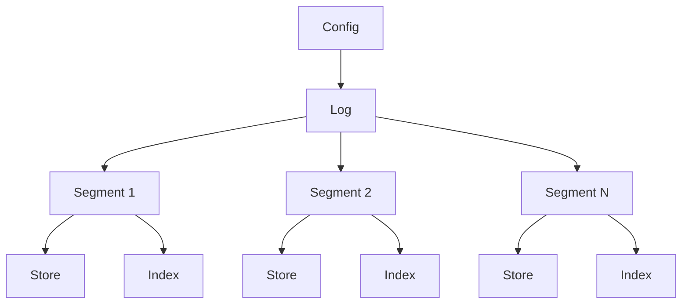

# Log Package

The `log` package provides a simple, efficient, and persistent log storage system for Go applications. It is designed to handle append-only logs, which are commonly used in distributed systems, event sourcing, and other scenarios where maintaining an ordered sequence of records is crucial.

## Key Components and Their Structure

1. **Log**: 
   - Main struct that represents the entire log system
   - Contains:
     - A slice of `*segment`
     - A `Config` struct
     - A mutex for thread-safety
   - Manages segments and provides high-level operations for appending and reading records

2. **Segment**: 
   - Represents a portion of the log
   - Contains:
     - A `store` for actual record storage
     - An `index` for quick record lookups
     - Base offset and next offset
   - Helps in managing the log's size and allows for efficient record retrieval

3. **Store**: 
   - Handles the actual storage of log records on disk
   - Contains:
     - A file pointer
     - Current file size
     - Base offset
   - Provides methods for appending and reading records from the store file

4. **Index**: 
   - Manages an index of record offsets
   - Contains:
     - A memory-mapped file
     - Current file size
     - Base offset
   - Allows for quick lookups of record positions within a segment

5. **Config**: 
   - Contains configuration options for the log system
   - Includes:
     - Directory path
     - Segment max bytes
     - Initial offset

## Component Interaction Flow



1. The `Log` is the main entry point and manages multiple `Segment`s.
2. Each `Segment` contains a `Store` for record storage and an `Index` for quick lookups.
3. The `Config` is used to initialize and configure the `Log`.

## Features

- Append-only log structure
- Segmented storage for efficient management of large logs
- Memory-mapped index for fast record lookups
- Configurable segment size and file paths
- Thread-safe operations

## Usage

To use the log package in your Go application:

1. Import the package:
   ```go
   import "path/to/internal/log"
   ```

2. Create a new log instance with a configuration:
   ```go
   config := log.Config{
       Dir:            "/path/to/log/directory",
       SegmentMaxBytes: 1024 * 1024, // 1 MB
   }
   log, err := log.NewLog(config)
   if err != nil {
       // Handle error
   }
   ```

3. Append records to the log:
   ```go
   record := []byte("Hello, Log!")
   offset, err := log.Append(record)
   if err != nil {
       // Handle error
   }
   ```

4. Read records from the log:
   ```go
   record, err := log.Read(offset)
   if err != nil {
       // Handle error
   }
   ```

5. Close the log when done:
   ```go
   err := log.Close()
   if err != nil {
       // Handle error
   }
   ```

## Testing

The package includes a comprehensive test suite in `log_test.go`. To run the tests, use the standard Go test command:

