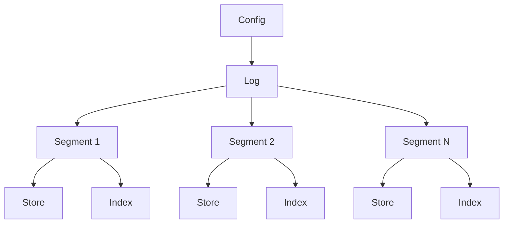

# Log Package

The `log` package provides a simple, efficient, and persistent log storage system for Go applications. It is designed to handle append-only logs, which are commonly used in distributed systems, event sourcing, and other scenarios where maintaining an ordered sequence of records is crucial.

## Key Components and Their Structure

1. **Log**: 
   - Main struct that represents the entire log system
   - Contains:
     - A slice of `*segment`
     - A `Config` struct
     - A mutex for thread-safety
   - Manages segments and provides high-level operations for appending and reading records

2. **Segment**: 
   - Represents a portion of the log
   - Contains:
     - A `store` for actual record storage
     - An `index` for quick record lookups
     - Base offset and next offset
   - Helps in managing the log's size and allows for efficient record retrieval

3. **Store**: 
   - Handles the actual storage of log records on disk
   - Contains:
     - A file pointer
     - Current file size
     - Base offset
   - Provides methods for appending and reading records from the store file

4. **Index**: 
   - Manages an index of record offsets
   - Contains:
     - A memory-mapped file
     - Current file size
     - Base offset
   - Allows for quick lookups of record positions within a segment

5. **Config**: 
   - Contains configuration options for the log system
   - Includes:
     - Directory path
     - Segment max bytes
     - Initial offset

## Component Interaction Flow



1. The `Log` is the main entry point and manages multiple `Segment`s.
2. Each `Segment` contains a `Store` for record storage and an `Index` for quick lookups.
3. The `Config` is used to initialize and configure the `Log`.

## Features

- Append-only log structure
- Segmented storage for efficient management of large logs
- Memory-mapped index for fast record lookups
- Configurable segment size and file paths
- Thread-safe operations

## Usage

To use the log package in your Go application:

1. Import the package:
   ```go
   import "path/to/internal/log"
   ```

2. Create a new log instance with a configuration:
   ```go
   config := log.Config{
       Dir:            "/path/to/log/directory",
       SegmentMaxBytes: 1024 * 1024, // 1 MB
   }
   log, err := log.NewLog(config)
   if err != nil {
       // Handle error
   }
   ```

3. Append records to the log:
   ```go
   record := []byte("Hello, Log!")
   offset, err := log.Append(record)
   if err != nil {
       // Handle error
   }
   ```

4. Read records from the log:
   ```go
   record, err := log.Read(offset)
   if err != nil {
       // Handle error
   }
   ```

5. Close the log when done:
   ```go
   err := log.Close()
   if err != nil {
       // Handle error
   }
   ```

## Testing

The package includes a comprehensive test suite in `log_test.go`. To run the tests, use the standard Go test command:

# Internal structure of the store and index file.

## Store file

The store file is a simple binary file that stores the log records one after another.
Each record is stored as length of the record in uint64 i.e. 8 bytes followed by the record itself.
When appendding a record to the store file it returns the position where the record is inserted, and updates it's in memory position as the 8 + size of record bytes.

## Index file

The index file is a memory mapped file that stores the position of the record in the store file. This is stored with offset i.e. the index at which the record is appended in the log. 
Every time a record is added the offset is increased. For each record index file stores the offset in first 4 bytes (unit32) and the position in the store file in the next 8 bytes (unit64). So totally 12 bytes are stored for each record in the index file.

The offset of the stored in the index file is the difference from the start of the main running offset and current records stored in the store file. For example if the store file starts at 10th record, and current offset of the record is 15th the offset stored in the index file is 5. The name of the file will be `10.index` and store file will be `10.store`. This is to make sure only 4 bytes are used to store the offset in the index file. Which can save a lot of space if the log is large.

Any time either the store or index file reaches the maximum capacity either in terms of records or stored bytes in store file, a new store and index file is created with a next offset. The next offset is the offset of the last record in the current store file plus one. All the new records are appended to the new store file and the index file. The offset stored in the new index file is relative to this offset.

## How to see it in action is using the hex dump of the files.

```bash
curl -X POST localhost:8080 -d \
    '{"record": {"value": "TGV0J3MgR28gIzEK"}}'

curl -X POST localhost:8080 -d \
    '{"record": {"value": "TGV0J3MgR28gIzIK"}}'
```
Adding these two records to the log, the store file will be as follows in the hex dump.

```bash
xxd /tmp/proglog/0.store
00000000: 0000 0000 0000 000e 0a0c 4c65 7427 7320  ..........Let's
00000010: 476f 2023 310a 0000 0000 0000 0010 0a0c  Go #1...........
00000020: 4c65 7427 7320 476f 2023 320a 1001 0000  Let's Go #2.....
00000030: 0000 0000 0010 0a0c 4c65 7427 7320 476f  ........Let's Go
00000040: 2023 320a 1002 0000 0000 0000 0010 0a0c   #2.............
00000050: 4c65 7427 7320 476f 2023 320a 1003 0000  Let's Go #2.....
00000060: 0000 0000 001a 0a16 4865 6c6c 6f20 7374  ........Hello st
00000070: 6f72 696e 6720 7468 6973 206c 6f67 1004  oring this log..
```
First 8 bytes `0000 0000 0000 000e` are the length of the record `Let's Go #1` which is 14 bytes.
Next 8 bytes `0000 0000 0000 0010` are the length of the record `Let's Go #2` which is 16 bytes.

In the index file the offset of the record in the store file is stored.

```bash
xxd /tmp/proglog/0.index
00000000: 0000 0000 0000 0000 0000 0000 0000 0001  ................
00000010: 0000 0000 0000 0016 0000 0002 0000 0000  ................
00000020: 0000 002e 0000 0003 0000 0000 0000 0046  ...............F
00000030: 0000 0004 0000 0000 0000 005e 0000 0005  ...........^....
00000040: 0000 0000 0000 0080 0000 0000 0000 0000  ................
```

First 4 bytes `0000 0000` are the offset of the record in the store file which is 0.
Next 8 bytes `0000 0000 0000 0000` are the position of the record 0 in the store file which is 0.

Next 4 bytes `0000 0001` are the offset of the record in the store file which is 1.
Next 8 bytes `0000 0000 0000 0016` are the position of the record 1 in the store file which is 22. 14 + 8 = 22, which is the position of the record 1 `Let's Go #2` in the store file.

